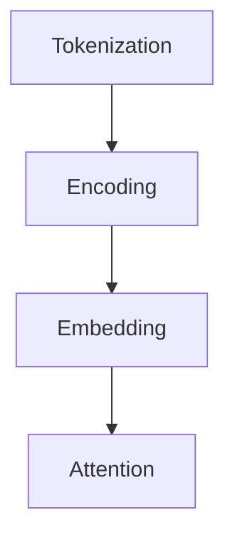

```mermaid
graph TD;
    A[Tokenization] --> B[Encoding];
    B --> C[Embedding];
    C --> D[Attention];

    click A href "../tokenization/README.md" "Tokenization Details"
    click B href "../encoding/README.md" "Encoding Details"
    click C href "../embedding/README.md" "Embedding Details"
    click D href "../attention/README.md" "Attention Details"
```
