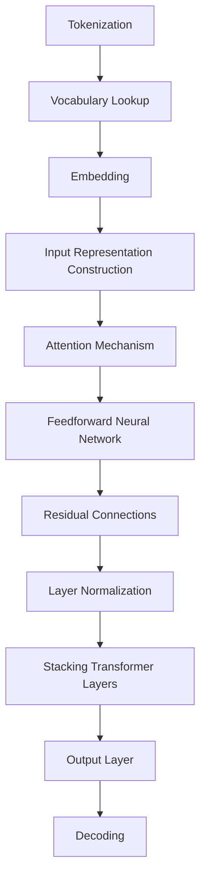

```mermaid
graph TD;
    A[Tokenization] --> B[Vocabulary Lookup];
    B --> C[Embedding];
    C --> D[Input Representation Construction];
    D --> E[Attention Mechanism];
    E --> F[Feedforward Neural Network];
    F --> G[Residual Connections];
    G --> H[Layer Normalization];
    H --> I[Stacking Transformer Layers];
    I --> J[Output Layer];
    J --> K[Decoding];

    click A href "tokenization/README.md" "Tokenization Details"
    click B href "vocabulary-lookup/README.md" "Vocabulary Lookup Details"
    click C href "embedding/README.md" "Embedding Details"
    click D href "input-representation-construction/README.md" "Input Representation Construction Details"
    click E href "attention/README.md" "Attention Mechanism Details"
    click F href "feedforward_nn/README.md" "Feedforward Neural Network Details"
    click G href "residual-connections/README.md" "Residual Connections"
    click H href "layer-normalization/README.md" "Layer Normalization Details"
    click I href "stacking-layers/README.md" "Stacking Transformer Layers Details"
    click J href "output-layer/README.md" "Output Layer Details"
    click K href "decoding/README.md" "Decoding Details"

```
